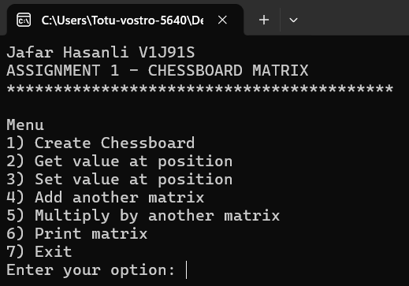
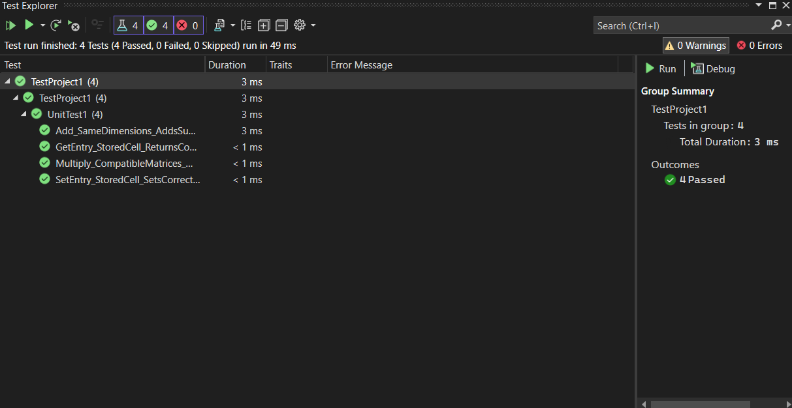

# Chessboard Matrix (C#)

## Overview

This project is a **C# console application** implementing a custom matrix type based on a **chessboard pattern**.

In this matrix representation:

- every second entry is always zero
- only cells located on one chessboard color may store nonzero values
- only these valid cells are stored internally
- zero-only cells are not stored in memory

The implementation supports:

- getting an entry
- setting an entry
- adding matrices
- multiplying matrices
- printing matrices
- console-based interaction
- basic unit testing

---

## Preview

### Console Menu



### Test Results



---

## Task Idea

The matrix follows a chessboard-like layout.

Valid nonzero positions are:

- `(1,1), (1,3), (1,5), ...`
- `(2,2), (2,4), ...`
- `(3,1), (3,3), ...`

Other positions are forced to be zero.

This means the class stores only the entries where:

```
(i + j) % 2 == 0
```

All other entries are treated as zero automatically.

---

## Storage Representation

Instead of storing the full matrix, the program stores only the valid cells in **row-major order**.

Example for a `3 x 3` matrix:

```
a11  0  a13
 0  a22  0
a31  0  a33
```

Internally, only these values are stored:

```
[a11, a13, a22, a31, a33]
```

This makes the representation more compact and follows the assignment requirement.

---

## Features

* Create a chessboard-pattern matrix
* Get value at a position
* Set value at a valid position
* Add another matrix of the same size
* Multiply with another compatible matrix
* Print the matrix in normal rectangular form
* Menu-driven console interface
* Includes unit tests

---

## Main Operations

### `GetEntry`

Returns the value at position `(i, j)`.

* If the indices are outside the matrix → throws `IndexOutOfRangeException`
* If the position is not a valid stored chessboard cell → returns `0`

### `SetEntry`

Sets the value at position `(i, j)`.

* If the indices are outside the matrix → throws `IndexOutOfRangeException`
* If the position is a forced-zero cell and value is nonzero → throws `InvalidOperationException`

### `Add`

Adds another chessboard matrix to the current one.

Condition:

* both matrices must have the same dimensions

### `Multiply`

Multiplies the matrix by another matrix.

Condition:

* number of columns of the first matrix must equal the number of rows of the second matrix

### `PrintMatrix`

Prints the matrix in normal `m x n` form.

---

## Project Structure

```
chessboard-matrix-csharp/
│
├── .gitignore
├── README.md
├── documentation.docx
├── menu.png
├── tests.png
│
├── chesboard/
│ ├── chesboard.csproj
│ ├── chesboard.sln
│ ├── Chessboard.cs
│ ├── Menu.cs
│ ├── Program.cs
│ ├── obj/
│ └── TestResults/
│
└── TestProject1/
├── TestProject1.csproj
├── GlobalUsings.cs
├── UnitTest1.cs
└── obj/
```

---

## Class Descriptions

### `Chessboard`

Main matrix class.

Responsibilities:

* compact internal storage
* entry access
* update operations
* addition
* multiplication
* formatted printing

### `Menu`

Provides the console user interface.

It allows the user to:

1. Create a matrix
2. Get a value
3. Set a value
4. Add another matrix
5. Multiply with another matrix
6. Print matrix
7. Exit

### `Program`

Application entry point.

### `UnitTest1`

Contains unit tests for:

* entry access
* setting values
* addition
* multiplication

---

## How It Works

### Internal Storage

Only valid chessboard cells are stored.

A helper method determines whether a cell is stored:

```
(i + j) % 2 == 0
```

### Index Mapping

The class converts matrix coordinates `(i, j)` into the corresponding internal index in the compact `List<int>`.

### Matrix Multiplication

Multiplication uses logical matrix values, meaning:

* invalid cells automatically behave like `0`
* valid cells contribute normally

---

## How to Run

Open the project in Visual Studio and run the console application.

Example menu:

```
1) Create Chessboard
2) Get value at position
3) Set value at position
4) Add another matrix
5) Multiply by another matrix
6) Print matrix
7) Exit
```

---

## Example

Example `3 x 3` matrix:

```
1   0   2
0   3   0
4   0   5
```

Stored internally as:

```
[1, 2, 3, 4, 5]
```

---

## Testing

The project includes unit tests for:

* valid and invalid entry access
* setting entries
* matrix addition
* matrix multiplication

These tests help verify that the compact representation still behaves like a normal matrix externally.

---

## Concepts Demonstrated

This project demonstrates:

* C# console programming
* custom compact data representation
* matrix operations
* exception handling
* row-major storage design
* menu-driven application development
* basic unit testing

---

## Educational Purpose

This project was created as an academic assignment to explore how matrices with structural constraints can be represented more efficiently than full 2D arrays.

---

## Author

Jafar Hasanli
Computer Science Student
Eötvös Loránd University (ELTE)